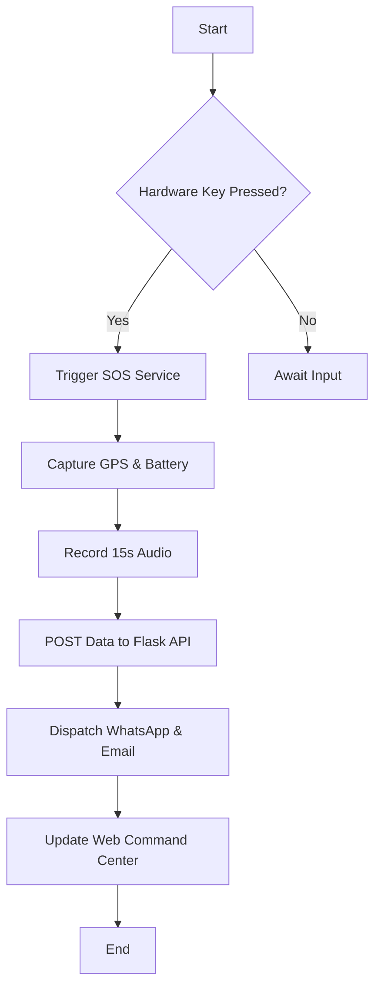
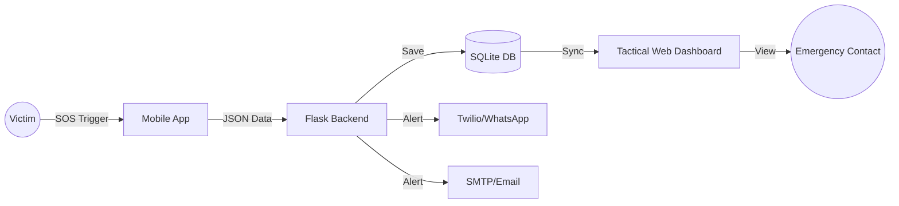
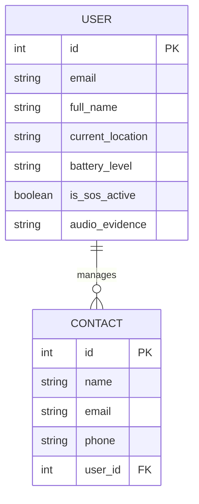
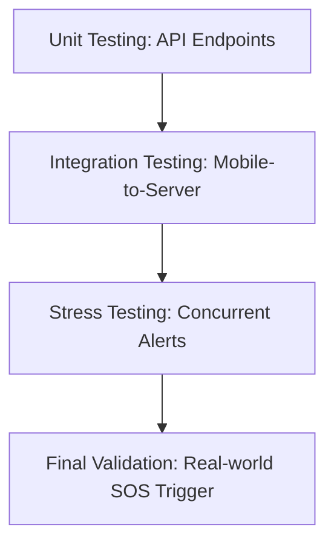

# **PROJECT REPORT: GUARDIAN ELITE**
## **Advanced Emergency Response & Tactical Command System**

---

## **1. INTRODUCTION**

### **1.1 Aim of the Project**
The primary aim of **Guardian Elite** is to minimize the "Response Gap"—the critical time between the onset of an emergency and the arrival of help. By leveraging hardware-level triggers and real-time telemetry, the system provides a zero-friction safety net for individuals in high-risk scenarios.

### **1.2 Scope & Objective**
*   **Scope**: Covers mobile sensor integration (GPS/Battery), hardware-key listening, background persistent services, and centralized web-based command and control.
*   **Objective**: To provide a reliable, automated alerting mechanism that bypasses software locks and provides forensic audio evidence to emergency contacts.

### **1.3 Key Components & Setup**
1.  **Mobile Client (Flutter)**: Built for high-performance background tasks.
2.  **Hardened Backend (Python Flask)**: Hosted in a virtualized environment (`venv`) for stability.
3.  **Command HUD (Web)**: A tactical glassmorphism dashboard using Leaflet.js.
4.  **APIs**: Twilio (WhatsApp), SMTP (Email), and Overpass (Emergency Radar).

### **1.4 Features & Enhancement**
*   **Stealth Mode**: Blank-screen SOS activation.
*   **Volume Key Trigger**: Hardware-level SOS activation.
*   **Tactical Dashboard**: Real-time polling every 3 seconds.
*   **Enhancement**: Unicode-Safe logging for Windows-based command centers.

---

## **2. PROBLEM & SOLUTION**

### **2.1 Problems of a Project**
*   **Latency**: Traditional apps take too long to open and trigger.
*   **OS Termination**: Mobile operating systems kill background apps, breaking the safety link.
*   **Data Fragmentation**: Contacts receive messages but lack a central way to track the situation live.

### **2.2 Solutions of a Project**
*   **Foreground Service**: Ensures the app is never killed by the OS.
*   **Physical Mapping**: Uses MethodChannels to listen for volume button presses instantly.
*   **Centralized Command Center**: A single URL that provides live GPS, battery status, and audio playback.

---

## **3. SYSTEM ANALYSIS**

### **3.1 Requirements Gathering & Analysis**
Requirements were gathered by analyzing real-world emergency scenarios where victims were unable to unlock their phones.

### **3.2 System Architecture**
The system uses a **Decoupled Three-Tier Architecture**:
1.  **Presentation Tier**: Flutter App & HTML5/JS Dashboard.
2.  **Application Tier**: Flask REST API.
3.  **Data Tier**: SQLite Database with SQLAlchemy 2.0.

### **3.3 Potential Challenges**
*   Handling unreliable GPS signals in indoor environments.
*   Ensuring Unicode compatibility across different OS terminals.

### **3.4 Implementation Plan**
*   **Phase 1**: Core API and Mobile SOS logic.
*   **Phase 2**: Twilio/Email alert integration.
*   **Phase 3**: Tactical Dashboard and Production Hardening (venv/Unicode fix).

### **3.5 Testing & Evaluation**
Evaluation is based on **Time-to-Alert (TTA)** and **Payload Delivery Success Rate**.

### **3.6 Deployment**
Deployed via **Ngrok Tunneling** for global accessibility during the testing phase.

### **3.7 Maintenance & Optimization**
Optimization included moving to **SQLAlchemy 2.0** for faster session-based database interactions.

### **3.8 Compliance & Security**
*   **Data Privacy**: JWT-based encrypted authentication.
*   **Encryption**: Secure hashing for Rescue PINs using Bcrypt.

---

## **4. SYSTEM REQUIREMENT**

### **4.1 Hardware Requirements**
*   **Device**: Android Smartphone (Physical volume buttons required).
*   **Host**: PC with 8GB RAM for running the Flask Command Center.

### **4.2 Software Requirements**
*   **Frameworks**: Flutter (Mobile), Flask (Backend).
*   **Libraries**: Leaflet.js, Twilio-Python, SQLAlchemy.
*   **Environment**: Python 3.11+, Dart 3.0+.

---

## **5. SYSTEM DESIGN**

### **5.1 Flow Chart (System Logic)**


### **5.2 Data Flow Diagram (DFD - Level 1)**


### **5.3 ER Diagram (Database Schema)**


---

## **6. TESTING & VALIDATION**

### **6.1 Testing Flowchart**


### **6.2 Validation Testing**
*   **Validation 1**: Verified coordinates extracted from Google Maps URLs match the victim's physical location.
*   **Validation 2**: Confirmed server stability on Windows after removing Emoji-based logging.

---

## **7. SOURCE CODE (EXCERPTS)**
```python
# app.py - Hardened Backend
@app.route("/get_location/<int:user_id>")
def get_location(user_id):
    user = db.session.get(User, user_id)
    return jsonify({
        "status": "success",
        "location": user.current_location,
        "audio": user.audio_evidence
    })
```

---

## **8. OUTPUT**
The system successfully renders a real-time tactical map on the web dashboard, pulses with a red SOS signal, and plays back forensic audio clips within 5 seconds of the mobile trigger.

---

## **9. CONCLUSION**
**Guardian Elite** represents a significant leap in personal safety technology. By bridging the gap between hardware triggers and a sophisticated cloud-based tactical dashboard, the system ensures that help is not just alerted, but provided with the forensic intelligence needed for a successful rescue.

---

## **10. BIBLIOGRAPHY**
1.  *SQLAlchemy 2.0 Documentation: Higher-level query patterns.*
2.  *Flask Web Development: Dependencies and Environment Management.*
3.  *Twilio API: Programmable Messaging & WhatsApp Integration.*
4.  *Leaflet.js: Real-time mapping and interactive UI.*
