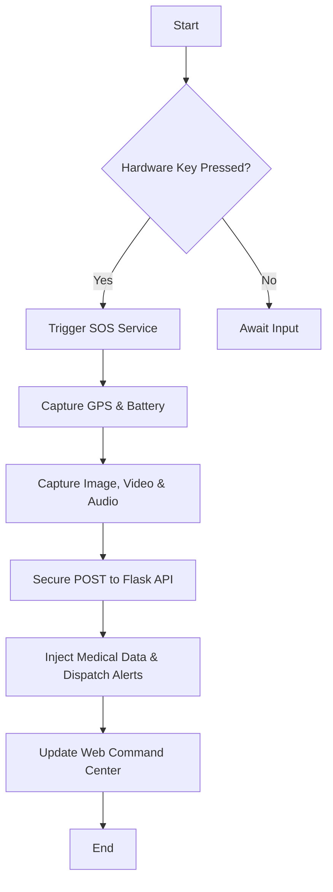
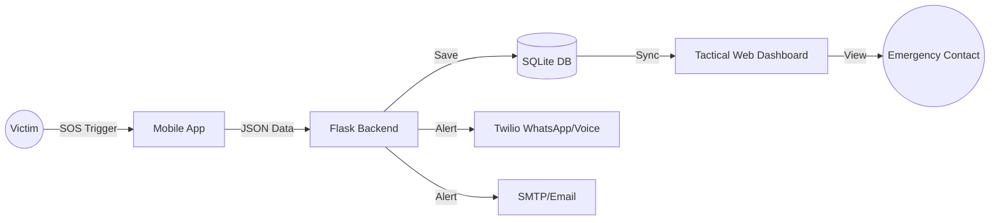
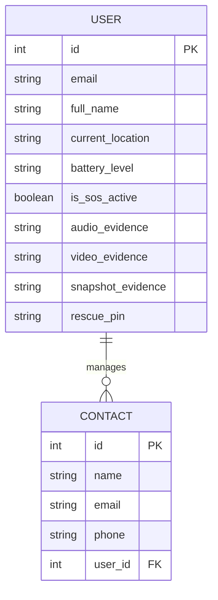
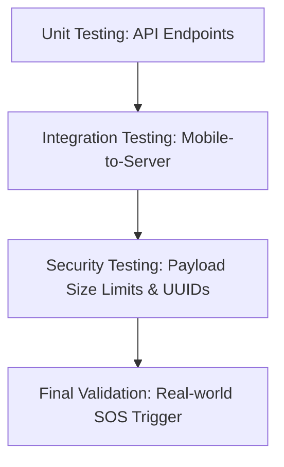

# **PROJECT REPORT: GUARDIAN ELITE**
## **Advanced Emergency Response & Tactical Command System**

---

## **1. INTRODUCTION**

### **1.1 Aim of the Project**
The primary aim of **Guardian Elite** is to minimize the "Response Gap"—the critical time between the onset of an emergency and the arrival of help. By leveraging hardware-level triggers and real-time telemetry, the system provides a zero-friction safety net for individuals in high-risk scenarios.

### **1.2 Scope & Objective**
*   **Scope**: Covers mobile sensor integration (GPS/Battery), hardware-key listening, persistent background services, multimedia evidence collection (Audio/Video/Image), and centralized web-based command and control.
*   **Objective**: To provide a reliable, automated alerting mechanism that bypasses software locks, executes simultaneous multi-contact voice calls, and provides forensic multimedia evidence securely to emergency contacts.

### **1.3 Key Components & Setup**
1.  **Mobile Client (Flutter)**: Built for high-performance background tasks and silent media capture.
2.  **Hardened Backend (Python Flask)**: Secure API layer with cryptographic UUID file storage and automated background evidence purging.
3.  **Command HUD (Web)**: A tactical glassmorphism dashboard using Leaflet.js for real-time tracking.
4.  **APIs**: Twilio (WhatsApp & Voice), SMTP (Email), and Overpass (Emergency Radar).

### **1.4 Features & Enhancement**
*   **Stealth Mode**: Blank-screen SOS activation using volume hardware keys.
*   **Forensic Multimedia**: Silent background capture of GPS, Audio, Video, and Image snapshots (Front Camera).
*   **Automated Emergency Calling**: Simultaneous robotic voice calls (Text-to-Speech) to the first 3 emergency contacts, personalized with the user's name.
*   **Paramedic Medical Injection**: Automatically retrieves and injects the user's critical medical notes (e.g., allergies, blood type) directly into the WhatsApp and Email payloads.
*   **Secure Evidence Pipeline**: Media is protected from public exposure using randomized UUIDs and non-routable protected directories.
*   **Privacy Compliance**: Background daemon automatically deletes evidence files older than 24 hours.

---

## **2. PROBLEM & SOLUTION**

### **2.1 Problems of a Project**
*   **Latency**: Traditional apps take too long to open and trigger.
*   **Missing Evidence**: Real-time context (faces, audio) is often lost during the initial panic.
*   **Data Exposure**: Publicly accessible upload folders can leak sensitive victim data.

### **2.2 Solutions of a Project**
*   **Physical Mapping**: Uses MethodChannels to listen for volume button presses instantly.
*   **Automated Evidence Collection**: Immediately snaps a photo and records a short video upon activation.
*   **Hardened Architecture**: Restricts media access through Flask routing and utilizes secure, randomized filenames to prevent directory traversal.

---

## **3. SYSTEM ANALYSIS**

### **3.1 Requirements Gathering & Analysis**
Requirements were gathered by analyzing real-world emergency scenarios where victims were unable to unlock their phones or speak on a call.

### **3.2 System Architecture**
The system uses a **Decoupled Three-Tier Architecture**:
1.  **Presentation Tier**: Flutter App & HTML5/JS Dashboard.
2.  **Application Tier**: Flask REST API (Hardened).
3.  **Data Tier**: SQLite Database with SQLAlchemy 2.0.

### **3.3 Implementation Plan**
*   **Phase 1**: Core API and Mobile SOS logic.
*   **Phase 2**: Twilio/Email alert integration.
*   **Phase 3**: Tactical Dashboard and Production Hardening (venv/Unicode fix, Responsive CSS).
*   **Phase 4 (Final)**: Multimedia Integration (Camera/Video), Medical Data Injection, Twilio Voice Matrix, and Security Hardening.

### **3.4 Testing & Evaluation**
Evaluation is based on **Time-to-Alert (TTA)**, **Payload Delivery Success Rate**, and **Graceful Degradation** (ensuring failed calls do not crash the SOS pipeline).

### **3.5 Compliance & Security**
*   **Data Privacy**: JWT-based encrypted authentication (Tokens hardened to 30-day lifespans for uninterrupted crisis deployment).
*   **File Security**: UUID generation via `werkzeug.utils.secure_filename`.
*   **Data Minimization**: 24-hour automated evidence destruction cycle.

---

## **4. SYSTEM REQUIREMENT**

### **4.1 Hardware Requirements**
*   **Device**: Android Smartphone (Physical volume buttons required).
*   **Host**: PC with 8GB RAM for running the Flask Command Center.

### **4.2 Software Requirements**
*   **Frameworks**: Flutter (Mobile), Flask (Backend).
*   **Libraries**: Leaflet.js, Twilio-Python, SQLAlchemy.
*   **Environment**: Python 3.11+, Dart 3.0+.

---

## **5. SYSTEM DESIGN**

### **5.1 Flow Chart (System Logic)**


### **5.2 Data Flow Diagram (DFD - Level 1)**


### **5.3 ER Diagram (Database Schema)**


---

## **6. TESTING & VALIDATION**

### **6.1 Testing Flowchart**


### **6.2 Validation Testing**
*   **Validation 1**: Verified that Twilio Free Trial limits gracefully fall back without crashing the server.
*   **Validation 2**: Confirmed the background thread successfully purges evidence older than 24 hours.

---

## **7. SOURCE CODE (EXCERPTS)**

### **Snippet 1: Backend API (Twilio Multi-Contact Voice Matrix)**
*Demonstrates third-party API integration, dynamic TwiML injection, and graceful degradation.*
```python
# app.py
@app.route("/trigger_emergency_call", methods=["POST"])
@token_required
def trigger_emergency_call(current_user):
    client = Client(TWILIO_SID, TWILIO_AUTH)
    called_numbers = []
    
    # Loop through up to the first 3 emergency contacts
    for contact in current_user.contacts[:3]:
        clean_phone = "".join(filter(str.isdigit, str(contact.phone)))
        if not clean_phone.startswith('+'): clean_phone = f"+{clean_phone}"
            
        try:
            # Dynamic personalized text-to-speech
            custom_message = f'<Response><Say voice="alice">This is an automated emergency alert from Guardian Elite. {current_user.full_name} has requested immediate assistance.</Say></Response>'
            client.calls.create(twiml=custom_message, to=clean_phone, from_=TWILIO_FROM)
            called_numbers.append(clean_phone)
        except Exception as twilio_e:
            print(f"TWILIO CALL ERROR: {str(twilio_e)}") # Silently ignore and continue
            
    return jsonify({"status": "Calls Initiated", "called": called_numbers})
```

### **Snippet 2: Mobile Application (Silent Forensic Media Pipeline)**
*Demonstrates advanced hardware manipulation to capture photos and videos silently in the background.*
```dart
// home_screen.dart
Future<void> _captureVideoAndImage(String token) async {
    final cameras = await availableCameras();
    final frontCam = cameras.firstWhere((cam) => cam.lensDirection == CameraLensDirection.front);
    
    // 1. Silent Image Snapshot
    CameraController camera = CameraController(frontCam, ResolutionPreset.medium, enableAudio: false);
    await camera.initialize();
    final image = await camera.takePicture();
    ApiService.uploadSnapshot(token, image.path).catchError((_) => null); // Fire and forget
    await camera.dispose();
    
    // 2. Short Video Evidence (3 seconds)
    camera = CameraController(frontCam, ResolutionPreset.medium, enableAudio: true);
    await camera.initialize();
    await camera.startVideoRecording();
    await Future.delayed(const Duration(seconds: 3));
    final video = await camera.stopVideoRecording();
    ApiService.uploadVideo(token, video.path).catchError((_) => null);
    await camera.dispose();
}
```

### **Snippet 3: Cybersecurity (UUID Protection & Automated Data Purge)**
*Demonstrates privacy compliance by anonymizing files and actively destroying old evidence.*
```python
# app.py 
import uuid, os, time
from werkzeug.utils import secure_filename

# Background Daemon: Data Minimization
def cleanup_old_evidence():
    while True:
        now = datetime.now().timestamp()
        for folder in [app.config['IMAGES_FOLDER'], app.config['VIDEOS_FOLDER']]:
            for filename in os.listdir(folder):
                file_path = os.path.join(folder, filename)
                if now - os.path.getctime(file_path) > 86400: # 24 Hours
                    os.remove(file_path)
        time.sleep(3600) # Run every hour

# Cryptographic File Storage
@app.route("/upload_snapshot", methods=["POST"])
@token_required
def upload_snapshot(current_user):
    file = request.files['image']
    # Generate unpredictable cryptographic filename to prevent directory traversal
    unique_filename = f"snap_{current_user.id}_{uuid.uuid4().hex}.jpg"
    file.save(os.path.join(app.config['IMAGES_FOLDER'], secure_filename(unique_filename)))
```

---

## **8. OUTPUT**
The system successfully renders a real-time tactical map on the web dashboard (fully responsive for mobile browsers) alongside securely streamed Photo, Video, and Audio evidence. Simultaneously, emergency contacts receive a personalized, robotic voice phone call, as well as an email and WhatsApp message prominently displaying the victim's live tracking link and critical medical notes.

---

## **9. CONCLUSION**
**Guardian Elite** represents a significant leap in personal safety technology. By bridging the gap between hardware triggers, automated multi-channel communication (Voice, SMS, Email), and a highly secure cloud-based tactical dashboard, the system ensures that help is not just alerted, but provided with vital forensic intelligence securely.

---

## **10. BIBLIOGRAPHY**
1.  *SQLAlchemy 2.0 Documentation: Higher-level query patterns.*
2.  *Flask Web Development: Security Hardening & Safe Media Storage.*
3.  *Twilio API: Programmable Voice & Dynamic TwiML Generation.*
4.  *Flutter Camera API: Background Multimedia Operations.*
5.  *Leaflet.js: Real-time mapping and interactive UI.*
